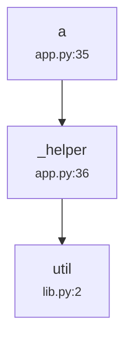
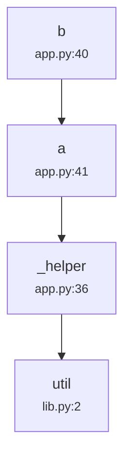

# INTERFACE_CHAIN

> 由 `python -m macdev audit` 生成。端点数: 2 · 扫描文件: 3 · 策略: base

## 1. 后端端点一览

| 方法 | 路径 | 函数 | 请求模型 | 返回字段 | 说明 |
|------|------|------|----------|----------|------|
| GET | `/api/a` | `a` | — | — |  |
| GET | `/api/b` | `b` | — | — |  |

## 2. Pydantic 请求模型

未检测到 Pydantic 模型。


## 3. 语义偏移检测（后端内部）

后端模型无重名。


## 8. 关键端点依赖链（亲属追逐 → 跨模块/存储）

> 静态调用图：入口 → 同文件 helper → 跨模块类方法 → 源文件定位。

> 同类方法已用 `类型.方法` 标记（如 `Agent.chat`），文件名即其定义位置。

> `↦ 亲属` = 跨文件反射定位（目标在本文件未解析，全项目索引命中）。

> 🔴 broken = 调用目标在项目内未找到定义（链路断裂，优先排查）。

### `GET /api/a` — `a`

```text
└ a [app.py:35]
  └ _helper [app.py:36]
    └ util (↦ 定义于 lib.py:2（func）) [lib.py:2]
```


### `GET /api/b` — `b`

```text
└ b [app.py:40]
  └ a [app.py:41]
    └ _helper [app.py:36]
      └ util (↦ 定义于 lib.py:2（func）) [lib.py:2]
```



## 9. def-use 属性一致性检查（跨文件）

> 扫描 `getattr(obj, 'attr', default)` 读取点，交叉验证全库是否存在 `obj.attr` 赋值点。

**读取点 0 · 赋值点 4 · 恒值风险 0（无赋值 0 / 对象不匹配 0 / 外部契约 0）**


✅ 核心业务代码中所有假值默认的 `getattr` 读取均有赋值点闭合。


## 10. 行为契约检查（must-call 路径覆盖）

> 依赖链只验证「被调用的函数存在」，无法验证「入口的正常完成路径必须触发某副作用」。

（未启用）


## 11. 状态标志生命周期检查（clear/set 配对 · 跨会话缓存重置）

**clear_without_set 1 · stale_cache 0**


### 🔴 clear 后无 set 恢复

| 标志 | 位置 | 说明 |
|------|------|------|
| `_chat_active` | macdev-skill\examples\sample_project\app.py:27 | 方法内 clear() 该 Event 标志但无 set() 恢复；若该处后续有 wait() 或跨调用依赖，可能永久阻塞或状态残留（需 finally 兜底） |

## 12. 状态机合并方向仲裁（数量仲裁 vs 版本仲裁）

（未启用）


## 13. 标识符命名空间来源契约（跨命名空间 key 误用 · 无守卫消费者）

（未启用）


## 14. 硬编码常量（4）

| 文件 | 行 | 类型 | 值 | 上下文 |
|------|----|------|----|--------|
| app.py | 14 | `key` | `sk-secret-demo-value` | API_KEY |
| app.py | 15 | `port` | `8123` | PORT |
| client\app.js | 3 | `path` | `/api/a` | path_literal |
| client\app.js | 6 | `path` | `/api/b` | path_literal |

## 15. 环境变量读取（0）

未检测到环境变量读取。


## 16. 数据池/状态（0）

未检测到数据池/状态。


## 17. 静态资源路径（0）

未检测到静态资源路径。

